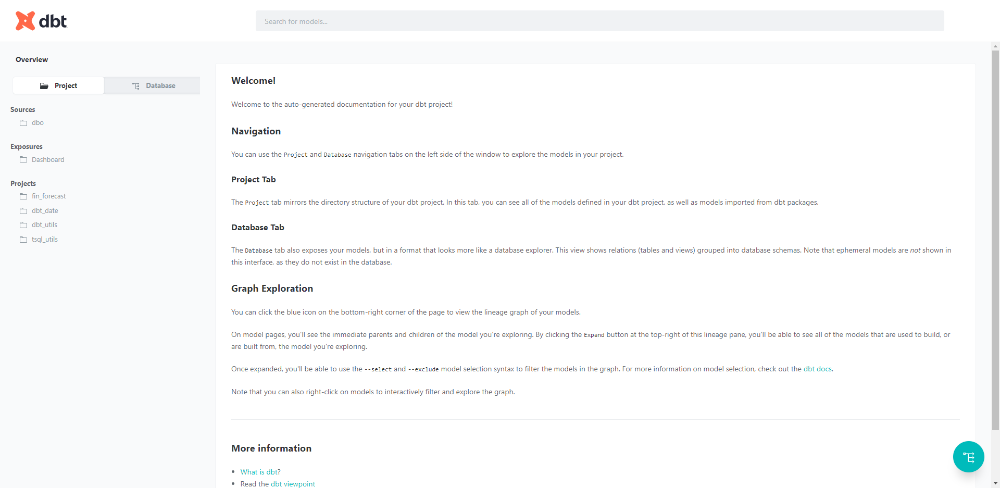
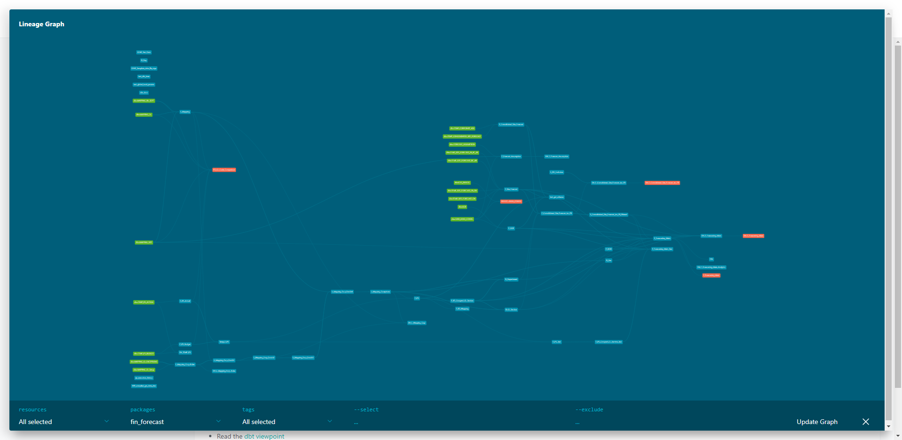
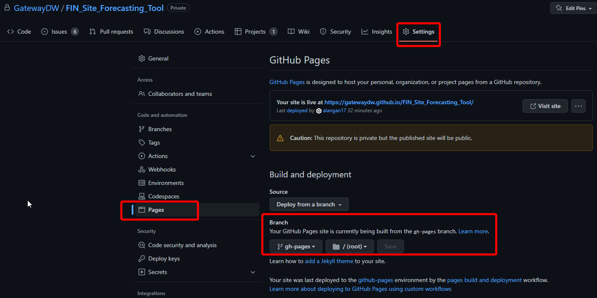
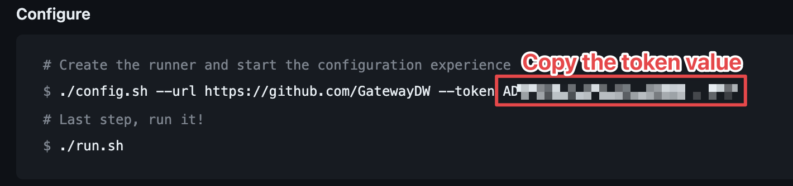
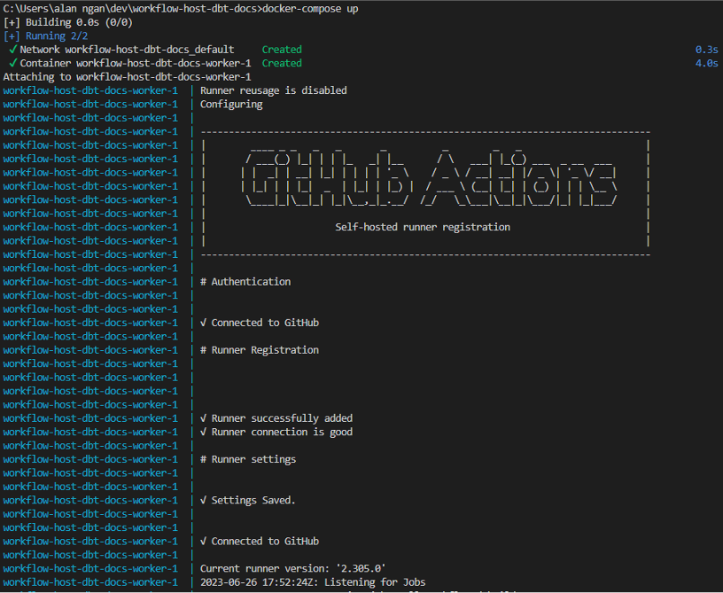
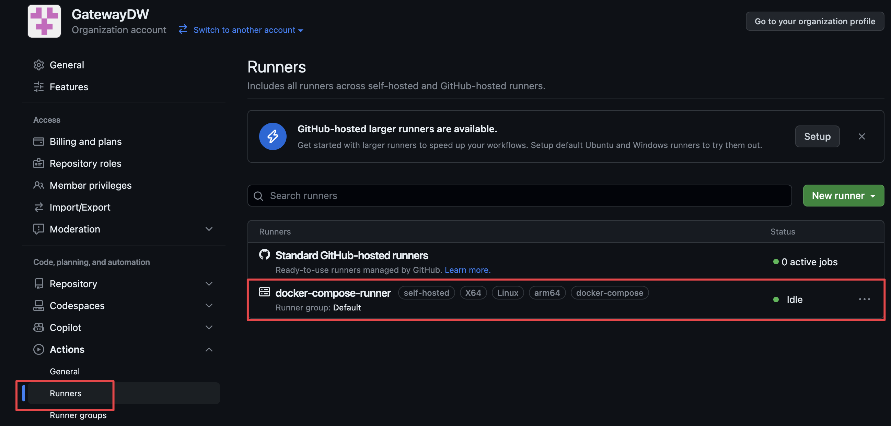

# GitHub Actions - host dbt docs on website (Reusable workflow)
- [GitHub Actions - host dbt docs on website (Reusable workflow)](#github-actions---host-dbt-docs-on-website-reusable-workflow)
  - [Steps to use this GitHub Workflow](#steps-to-use-this-github-workflow)
  - [Steps to spin up self-hosted GitHub Actions runner (using conda)](#steps-to-spin-up-self-hosted-github-actions-runner-using-conda)
  - [Steps to spin up self-hosted GitHub Actions runner (using Docker)](#steps-to-spin-up-self-hosted-github-actions-runner-using-docker)
  - [Steps to stop self-hosted GitHub Actions runner (using Docker)](#steps-to-stop-self-hosted-github-actions-runner-using-docker)

This is the Github Action to host dbt docs on GitHub pages when there is changes in the repo.

Example of dbt docs:



Ref: https://www.youtube.com/watch?app=desktop&v=I-yT2Err6PE

## Steps to use this GitHub Workflow
1. Check if there is secret `DBT_PROFILE` created in repo > Secrets
  
2. Copy the dbt profile config from profiles.yml to Github > your repo > Settings > Secrets > Actions > New repository secret
    Name: DBT_PROFILE
    Value: <dbt profile config>
    dbt profiles documentation https://docs.getdbt.com/reference/profiles.yml

3. From the caller repository, create a .yml file in the .github/workflows folder (see the example repo https://github.com/GatewayDW/test_ghw_dbt_docs/blob/main/.github/workflows/call_host_dbt_docs.yml)
  ```yml
  name: Build and Deploy dbt docs to Github Pages

  on:
    pull_request:
      branches: [main]

    push:
      branches:
        - main
    # workflow_dispatch:
    
  jobs:
    call-workflow:
      uses: GatewayDW/workflow-host-dbt-docs/.github/workflows/host_dbt_docs.yml@main
      with:
        runner_type: self-hosted
        dbt_project_path: <dbt project relative path e.g. etl/DOR>

      # https://docs.github.com/en/actions/using-workflows/reusing-workflows#passing-inputs-and-secrets-to-a-reusable-workflow

      secrets:
        secrets_dbt_profile: ${{ secrets.DBT_PROFILE }}
  ```

4. Make changes in your repo, commit and push to main branch. The workflow will be triggered based on the trigger condition in step 3 `on` block [Ref: Workflow Trigger](https://docs.github.com/en/actions/using-workflows/events-that-trigger-workflows).

5. For the 1st time CI execution, there will be an new branch `gh-pages` created. Go to settings > Pages > Select `gh-pages` branch > Save.
   For subsequent CI execution, the dbt docs metadata will be updated in the `gh-pages` branch.


6. A new workflow will be created and executed automatically after step 5 and subsequent repo update actions. The dbt docs will be hosted on the website.


## Steps to spin up self-hosted GitHub Actions runner (using conda)
> [!NOTE]
> There is an known issue on network issue when using Windows Server. (#71)
> The workaround is to use either Docker or other Windows PC (Check if it can connect to the target database first)

1. [Setup the conda environment](/docs/setup_environment.md)
2. Open the browser and go to [Create new self-hosted runner](https://github.com/organizations/GatewayDW/settings/actions/runners/new)
3. Follow the steps to download the runner program
4. Copy the token value from the instruction page (Note: the token might change after the runner is created, or periodically)
   Paste it to `.env` file `RUNNER_TOKEN` field
   
5. Execute the below script in root folder:
   ```cmd
   call start_github_action_runner.bat
   ```
6. To stop the runner, press `Ctrl + C` in the terminal. It is recommended to stop the runner when not in use.

## Steps to spin up self-hosted GitHub Actions runner (using Docker)
Self-hosted runners can connect to on-premise machines or cloud VMs. You can use a self-hosted runner in a virtual network. Self-hosted runners offer more control of hardware, operating system, and software tools than GitHub-hosted runners provide.

1. Copy file `.env.sample` and rename to `.env`
2. Ensure that the `.env` is not committed to the repo
3. Open the browser and go to [Create new self-hosted runner](https://github.com/organizations/GatewayDW/settings/actions/runners/new)
4. Copy the token value from the instruction page (Note: the token might change after the runner is created, or periodically)
   
5. Paste the token value to `credentials.yml` file `RUNNER_TOKEN` field
6. In terminal, run the following command to spin up the self-hosted runner
   ```bash
   docker-compose up
   ```
   
7. In GitHub Actions Runner page, you should see the new runner is online
   

## Steps to stop self-hosted GitHub Actions runner (using Docker)
1. In terminal, run the following command to stop the self-hosted runner
   ```bash
   docker-compose down
   ```
